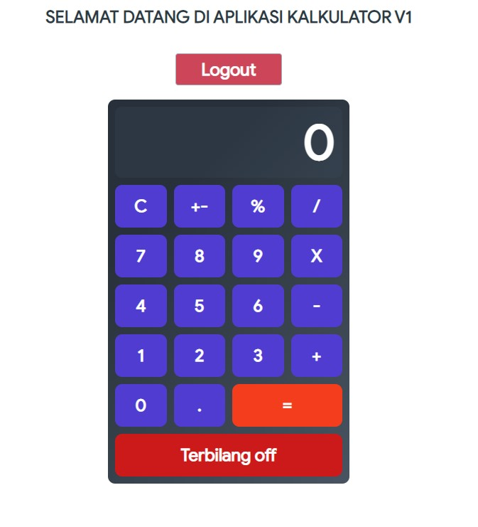
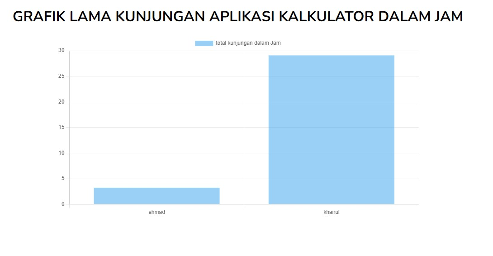

# CALCULATOR V1

## Table of Contents

- [Getting Started](#getting-started)
  - [Prerequisites](#prerequisites)
  - [Installation](#installation)
  - [Setup](#Setup)
- [Screenshots](#screenshots)
- [Author](#author)

## Getting Started

Before starting to install the project, there're some things that need to be done first.

### Prerequisites

Make sure all of these are properly installed in your system.

| Application  | Download                                                                            |
| ------------ | ----------------------------------------------------------------------------------- |
| Git          | [Windows](https://gitforwindows.org/) / [Linux](https://git-scm.com/download/linux) |
| Node.js      | [Link](https://nodejs.org/en/download/)                                             |
| MongoDB      | [Link](https://www.mongodb.com/try/download)                              |
| Composer     | [Link](https://getcomposer.org/)                                                    |

### Installation

First, clone this repository into your system.

```
git clone https://github.com/ahmadkhairul/calculator-app.git
```

Then, install all the packages that described in all `package.json` for every folder.

```
npm install
```

### Setup

1. set up calculator-server. make sure install MongoDB. Then run `npm run seed` and run `npm start` in `calculator-api` folder.
2. set up calculator-client. go to calculator folder. Then run `npm start`. To use the app `localhost:3000` will automatically opened if not you can visit by yourself.
3. there are 2 user available to use, you can always add more user via `seeder.js` file on `calculator-api` folder and then do `npm run seed`.
- username: ahmad, password: 12345
- username: khairul, password: 54321
4. set up visitor-chart. make sure composer installed and [mongoDB Driver installed on PHP](https://www.opentechguides.com/how-to/article/php/114/laravel-mongodb-config.html), open `visitor-chart` folder and run `php artisan serve`. To use the app `localhost:8000` will automatically opened if not you can visit by yourself.

## Screenshots




## Refference
1. https://www.sitepoint.com/react-tutorial-build-calculator-app/
2. https://www.opentechguides.com/how-to/article/php/114/laravel-mongodb-config.html
3. https://www.chartjs.org/docs/latest/getting-started/

## Author

**Ahmad Khairul Anwar** - [Ahmad Khairul](https://github.com/ahmadkhairul)
